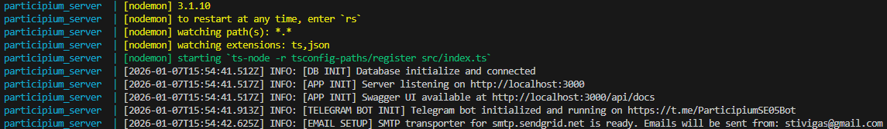
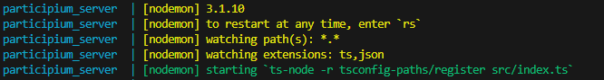

## Create the `working` folder

The development team will give you 2 files :
- `docker-compose.prod.yaml` : the file needed to start the application
- `prod.env` : the "private" environment file containing sensitive information (e.g., passwords, secret keys, etc...)  

First of all, you have to create a folder named `working` in a secure place of your server where you will put the files provided to you and where the application will run.
## Move the `docker-compose.prod.yaml` and `prod.env` into `working` folder

You now have to insert the file provided to you (`docker-compose.prod.yaml` and `prod.env`) inside the `working` folder previously created

> [!WARNING]
> The `prod.env` has to be kept and exchanged in a secure way because it contains sensitive information (e.g., passwords, secret keys, etc.)

## Create the `admin` profile

In order to create the `admin` profile, you have to modify the `prod.env` file previously moved into the `working` folder, by setting the variable `ADMIN_PASSWORD` with the password you want to use for the `admin` profile.
The `admin` profile is necessary to create new municipality users (such as Technical Office Staff Members, External Maintainers, Public Relations Officers etc...).  
The `admin` username is `admin`, it is fixed and cannot be changed.

## Execute the application

Now that everything you need is in the right place, you have to execute the following commands INSIDE of the `working` folder :

Linux/MacOS environments :

    docker compose -f ./docker-compose.prod.yaml --env-file ./prod.env up -d

Windows environments :

    docker compose -f .\docker-compose.prod.yaml --env-file .\prod.env up -d

> [!WARNING]
> The application will be actually working ONLY when the server has printed all the following lines, this means that all the components have been correctly initialized (they can appear in a different order) : 
    
    [<date and hour>] INFO: [EMAIL SETUP] SMTP transporter for smtp.sendgrid.net is ready. Emails will be sent from: stivigas@gmail.com
    [<date and hour>] INFO: [DB INIT] Database initialize and connected
    [<date and hour>] INFO: [APP INIT] Server listening on http://localhost:3000
    [<date and hour>] INFO: [APP INIT] Swagger UI available at http://localhost:3000/api/docs
    [<date and hour>] INFO: [TELEGRAM BOT INIT] Telegram bot initialized and running on https://t.me/ParticipiumSE05Bot

you can check it by inspecting the logs of the server executing the command :

    docker compose -f ./docker-compose.prod.yaml logs --follow server

CHECK CAREFULLY FOR THOSE LINES, IF THEY ARE NOT PRESENT IT MEANS THAT THE APPLICATION IS NOT YET WORKING PROPERLY.  
(below there are 2 images to help you identify the 2 situations, the first one is when the application is correctly started, the second one when it is not yet started)

## Stop the application

If you want to stop the application, you have to execute the following commands in the `working` folder :

Linux/MacOS environments :

    docker compose -f ./docker-compose.prod.yaml --env-file ./prod.env down --volumes --remove-orphans

Windows environments :

    docker compose -f .\docker-compose.prod.yaml --env-file .\prod.env down --volumes --remove-orphans

## INFO

The application starts with 2 pre-defined users :
- An administrator with username `admin` and as password, the one defined in the `prod.env` file under the variable name `ADMIN_PASSWORD`
- A citizen user with username `user` and password `user`

The administrator needs to exist in order to create new municipality users (such as Technical Office Staff Members, External Mainatiners, Public Relations Officers etc...), the user is there just to give the possibility to go around the application as a normal citizen, so that the customer can see how the application works from a citizen point of view without the need to create a new user by himself.

The served `offices` are the following :
- `Organization`  
- `Public Services Division`
- `Environmental Quality Division`
- `Green Areas, Parks and Animal Welfare Division`
- `Infrastructure Division`
- `General Services Division`.

While the `categories` in which a report can be classified, together with the related `office`, are :  
- `Water Supply - Drinking Water`, office: `Public Services Division`
- `Architectural Barriers`, office: `Infrastructure Division`
- `Sewer System`, office: `Public Services Division`
- `Public Lighting`, office: `Public Services Division`
- `Waste`, office: `Environmental Quality Division`
- `Road Signs and Traffic Lights`, office: `Infrastructure Division`
- `Roads and Urban Furnishings`, office: `Infrastructure Division`
- `Public Green Areas and Playgrounds`, office: `Green Areas, Parks and Animal Welfare Division`
- `Other`, office: `General Services Division`  

