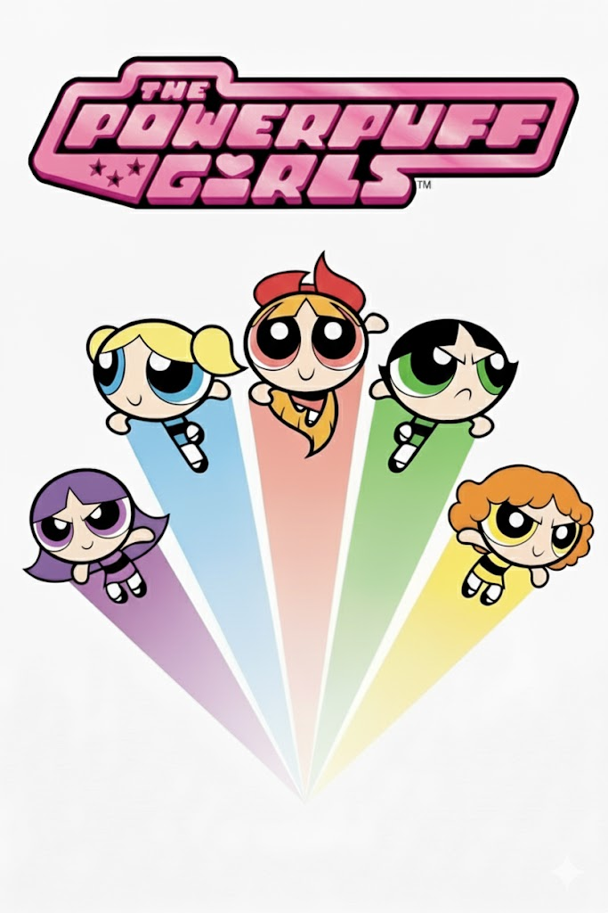

# TEMPLATE FOR RETROSPECTIVE (Team 05)

The retrospective should include _at least_ the following
sections:

- [process measures](#process-measures)
- [quality measures](#quality-measures)
- [general assessment](#assessment)

## PROCESS MEASURES

### Macro statistics

- Number of stories committed vs done : 4/4 
- Total points committed vs done : 15/15
- Nr of hours planned vs spent (as a team) : 80h/78h 52m

**Remember** a story is done ONLY if it fits the Definition of Done:

- Unit Tests passing
- Code review completed
- Code present on VCS
- End-to-End tests performed

> Please refine your DoD

### Detailed statistics

| Story | # Tasks | Points | Hours est. | Hours actual |
| ----- | ------- | ------ | ---------- | ------------ |
| _#0_  |    17   | -      |  58h 15m   |   53h 30m    |
| PT24 - Assign Reports to External Maintainers     |     12    |    5    |     6h 20m       |       7h 37m       |
| PT25 - Update Report Status as External Maintainer     |     7    |    2    |     2h 10m       |      1h 56m      |
| PT26 - Internal Information Exchange on Reports     |     7    |    5    |     6h 30m       |      9h 15m      |
| PT27 - Citizen Registration Confirm    |     11    |    3    |     6h 45m       |      6h 34m      |

> place technical tasks corresponding to story `#0` and leave out story points (not applicable in this case)

- Hours per task (average, standard deviation)
  
|            | Mean  | StDev |
| ---------- |------ |-------|
| Estimation | 1.4814| 2.47 |
| Actual     | 1.4604| 2.26 |

- Total task estimation error ratio: sum of total hours estimation / sum of total hours spent -1: 

  $$\frac{\sum_i estimation_{task_i}}{\sum_i spent_{task_i}} - 1$$ = 0.01436 (1.44%)
 
- Absolute relative task estimation error: sum( abs( spent-task-i / estimation-task-i - 1))/n:

  $$\frac{1}{n}\sum_i^n \left| \frac{spent_{task_i}}{estimation_task_i}-1 \right| $$ =  0.2395 (23.95%)

## QUALITY MEASURES

- Unit Testing:
  - Total hours estimated: 3h 15m
  - Total hours spent: 3h 20m
  - Nr of automated unit test cases: 197
  - Coverage (if available): 90.83%
- Integration testing:
  - Total hours estimated: 3h 15m
  - Total hours spent: 3h 55m
  - Nr of automated integration test cases: 311
  - Coverage (if available): 93.21%
- E2E testing:
  - Total hours estimated: 3h 15m
  - Total hours spent: 3h 30m
  - Nr of automated integration test cases: 197
  - Coverage (if available): 85.62%
- Code review:
  - Total hours estimated: 2h
  - Total hours spent: 1h 22m
- Technical Debt management:
  - Strategy adopted: 
    > Team members review SonarQube Cloud at every merge to the main branch and decide on how to act (e.g., fix immediately, create a TD task, or accept the issue with justification).
    
    > Team members check the real-time analysis in the IDE before committing code to be aware of the issues they might introduce and decide on how to act.

  - Total hours estimated estimated at sprint planning: 8h 55m
  - Total hours spent: 8h 55m

## ASSESSMENT

- What caused your errors in estimation (if any)?
  
  > Implementing internal communication lead to refactoring both tests and the architecture hence more time than expected.

- What lessons did you learn (both positive and negative) in this sprint?

  >  Negative: Refactoring took more time than expected.
  
  >  Positive: We adopted quickly to the backlog changes and did not have many problems implementing the new features

- Which improvement goals set in the previous retrospective were you able to achieve?
  
  > We improved UI testing, allocated more time for refactoring and had much better frontend. 
  
- Which ones you were not able to achieve? Why?

  > We achieved all of them.

- Improvement goals for the next sprint and how to achieve them (technical tasks, team coordination, etc.)
  
  > More populated map with actual data
  > The app should have more data to present  

- One thing you are proud of as a Team!!

  > We are Powerpuff Girls! We overcome all problems that arise without blaming anyone and help each other!
  
    
